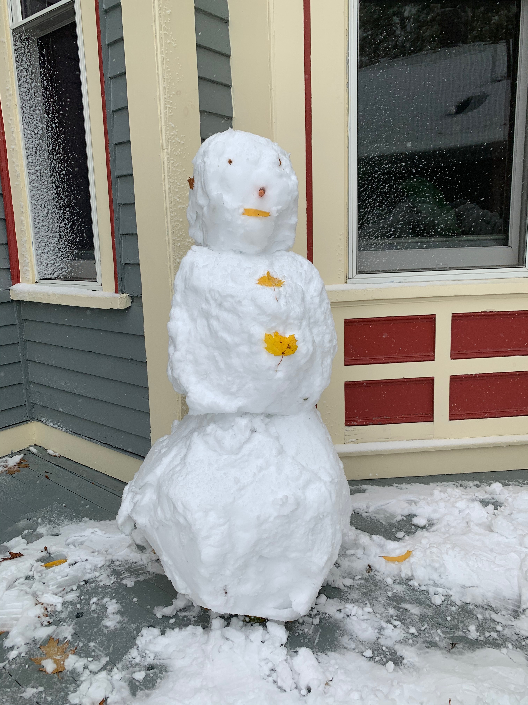
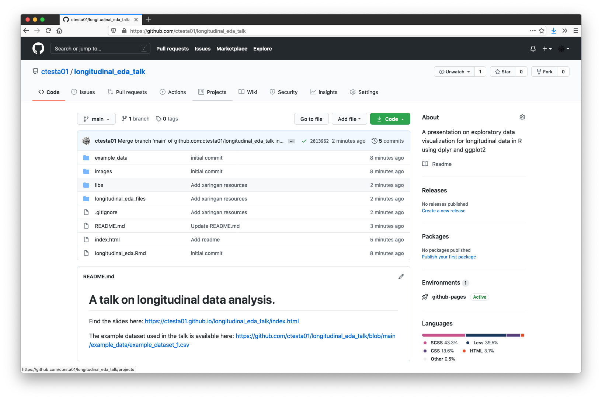

name: xaringan-title
class: left, middle, inverse
background-color: '#BBB'
background-size: cover

```{css, echo = FALSE}
.remark-code-line-highlighted { background-color: rgba(97, 172, 240, .5) !important; }

.huge .remark-code { /*Change made here*/
  font-size: 125% !important;
}


.tiny .remark-code { /*Change made here*/
  font-size: 50% !important;
}
```


# Exploratory Data Visualization for Longitudinal Data

<div style='font-size: 25px;'>

Christian Testa <br>
<a href='mailto:ctesta@hsph.harvard.edu'>`r icon::fa('envelope')` ctesta@hsph.harvard.edu</a> <br>
<a style='color: #55acee;' href='https://twitter.com/_christiantesta'>`r icon::fa("twitter")` @_christiantesta</a> <br>
<a style='color: #636e72;' href='https://github.com/ctesta01'>`r icon::fa("github")` ctesta01</a> <br> <br>

October 30th, 2020
</div>
  
```{r echo=F, warning=F, message=F}
# The following code snippet detaches all packages.
# This is important because if tidyverse is already loaded from a previous 
# session, the loading messages won't show in the knit version of this document.
# 
# https://stackoverflow.com/questions/7505547/detach-all-packages-while-working-in-r#39235076
if ('package:tidyverse' %in% search()) 
  invisible(lapply(paste0('package:', names(sessionInfo()$otherPkgs)), detach, character.only=TRUE, unload=TRUE))
```

```{r echo=F, warning=F, message=F}
# some config options
options(knitr.table.format = "html")
# knitr::opts_chunk$set(cache=T)
```

---
# A Quote 

.pull-left[
"The greatest value of a picture is when it forces us to notice what we never expected to see." –John Tukey
]

.pull-right[

]

---
# Aims

- Learn how to use data manipulation tools such as `dplyr` and `tidyr`
- Learn how to use `ggplot2`, a powerful, flexible framework for visualizing data in R
- Learn where to find more resources
  


---
# Before we get started

There are some packages you'll want to make sure you have installed.

```{r eval=F}
install.packages("tidyverse")
```


```{r, message=T, warning=T}
library(tidyverse, quietly = F, warn.conflicts = T)
```

---
# Example Data Set

```{r}
df <- readr::read_csv("example_data/example_dataset_1.csv")
```

--

Why use `readr::read_csv`?
- Reports on the assumed column types, with options to override
- Loads faster
- Loads into a tibble, which are faster, better data.frames.
  
---
# Check out the data

```{r}
knitr::kable(head(df,4))
```

Note that: 
- Data is in a wide format
- Column names need cleaning
- We have groups of participants

---
# Examine the categorical variables

Let's check what those groups are:

```{r}
unique(df$group)
```

--
```{r}
table(df$gender) 
```

---
# Summarize quantitative variables
--
```{r}
df %>% select(-c(group, gender)) %>% 
  summary()
```
--
... Let's break this one down.

---


  

# Intro to `%>%` and dplyr

```{r eval=F}
df %>% select(-c(group, gender)) %>% 
  summary()
```


`%>%`, the pipe operator, comes from the `magrittr` package, but is also included 
in `dplyr`.


--
`x %>% f()` is equivalent to `f(x)` <br>
`x %>% f(y)` is equivalent to `f(x,y)` 


--
`df %>% select(-c(group, gender))` is equivalent to <br>`select(df, -c(group, gender))`


--
Read `x %>% f(y)` as "`x` gets passed to `f` with additional 
argument `y`."


--
Using pipes helps to:
  1. chain several commands together,
  2. without creating unnecessarily nested one-liners, e.g. <br>
  `summary(select(df, -group))`

---
# What's the deal with select?

```{r eval=F}
df %>% select(-c(group, gender)) %>% 
  summary()
```

`select` is the command for subsetting the columns of a data.frame or 
tibble.


--
Notice that `group` and `gender` are not in quotes. This is because `dplyr` and
many of the functions in the tidyverse use tidy-evaluation, which allows users
to reference column names of data.frames and tibbles as if they are variables
within tidyverse functions.


--
The minus sign is saying that we want to remove group and gender, or
equivalently to select all of the columns except for group and gender.


```{r echo=F}
df %>% select(-c(group, gender)) %>% 
  summary()
```

---
# Let's add participant ID numbers

```{r}
df <- df %>% 
  mutate(id = 1:nrow(.)) %>% 
  select(id, everything())

knitr::kable(head(df,3))
```


--
Note the use of `.` here, which refers to the argument 
passed using `%>%`. 


--
Equivalently, we could have written `mutate(df, id = 1:nrow(df))`.


--
`everything()` is part of the `tidyselect` package and system which 
helps with the programmatic selection of columns and offers other 
helpful functions like `starts_with` or `contains`.


---

# Let's convert to a tidy format

```{r}
df <- df %>% tidyr::pivot_longer(
  cols = starts_with('X'),
  names_to = 'year')

knitr::kable(head(df, 4))
```

---
# Get rid of "X"

```{r}
df <- df %>% 
  mutate(year = stringr::str_remove(year, "X"))

knitr::kable(head(df, 4))
```

---
# Now we can do some plotting 

.pull-left[
```{r ggplot-point, fig.show='hide'}
ggplot(data = df,  
 aes(x = year, y = value)) + 
   geom_point()
```

]

.pull-right[
```{r ref.label = 'ggplot-point', echo = FALSE, fig.width=3, fig.height=3, out.width='100%', fig.retina = 6}
```
]

---
# Now let's try geom_line

.pull-left[
```{r ggplot-line, fig.show='hide'}
ggplot(data = df,  
 aes(x = year, y = value,
     group = id)) + #<<
   geom_line()
```

]

.pull-right[
```{r ref.label = 'ggplot-line', echo = FALSE, fig.width=3, fig.height=3, out.width='100%', fig.retina = 6}
```
]

---
# Adding color

.pull-left[
```{r ggplot-line+color, fig.show='hide'}
ggplot(data = df,  
 aes(x = year, y = value,
     group = id,
     color = group)) + #<<
   geom_line(alpha=0.5) #<<
```

]

.pull-right[
```{r ref.label = 'ggplot-line+color', echo = FALSE, fig.width=3, fig.height=3, out.width='100%', fig.retina = 6}
```
]

---
# Facet Wrapping

.tiny[
```{r ggplot-line+color+facetwrap, fig.show='hide'}
ggplot(data = df,  aes(x = year, y = value, group = id, color = group)) +
  geom_line(alpha=0.5) + 
  facet_wrap(~group) #<<
```
]

```{r ref.label = 'ggplot-line+color+facetwrap', echo = FALSE, fig.width=8, fig.height=5, out.height='100%', fig.retina = 6, fig.align='center'}
```

---
# Facet Grid

.tiny[
```{r ggplot-line+color+facetgrid, fig.show='hide'}
ggplot(data = df,  aes(x = year, y = value, group = id, color = group)) +
  geom_line(alpha=0.5) + 
  facet_grid(gender~group) + #<<
  ggtitle("Different groups had different trajectories")
```
]

```{r ref.label = 'ggplot-line+color+facetgrid', echo = FALSE, fig.width=8, fig.height=5, out.height='100%', fig.retina = 6, fig.align='center'}
```


---
# Using Stat Summaries

.tiny[
```{r ggplot-line+statsum+facetwrap, fig.show='hide'}
ggplot(data = df,  aes(x = year, y = value, group = id, color = gender)) +
  geom_line(alpha=0.5) + 
  facet_wrap(~group) + 
  stat_summary(aes(group = interaction(group, gender)), fun = mean, geom='line', color = 'black') + 
  stat_summary(aes(group = interaction(group, gender), shape=gender), fun = mean, geom='point', size=2, color = 'black') + 
  labs(shape = 'Gender and Group\nLevel Average', color = 'Gender') +
  ggtitle("Men have higher values than women")
```
]

```{r ref.label = 'ggplot-line+statsum+facetwrap', echo = FALSE, fig.width=8, fig.height=5, out.height='100%', fig.retina = 6, fig.align='center'}
```

---
# Another way using boxplots

.tiny[
```{r ggplot-boxplot+statsum, fig.show='hide'}
ggplot(data = df,  aes(x = year, y = value, color = gender)) +
  geom_boxplot(alpha=0.5) + 
  stat_summary(aes(group = interaction(group, gender), shape=''), position = position_dodge(width=0.75), 
               fun = mean, geom='point', color = 'grey10', alpha=0.8) +
  facet_wrap(~group) + 
  labs(color = "Gender", shape = "Gender + Group\nLevel Average") + 
  ggtitle("Men often had greater variance than women")
```
]


```{r ref.label = 'ggplot-boxplot+statsum', echo = FALSE, fig.width=8, fig.height=5, out.height='100%', fig.retina = 6, fig.align='center'}
```

---
# Using `geom_ribbon`

.tiny[
```{r ggplot-geomribbon, fig.show='hide'}
df %>% group_by(group, gender, year) %>%
  summarize(
    ci_high = quantile(value, 0.975),
    ci_low = quantile(value, 0.025),
    mean = mean(value),
    .groups = 'keep') %>%
  
  ggplot(aes(x = year, y = mean, ymax = ci_high, 
       ymin = ci_low, group = gender, fill = gender)) +
    geom_ribbon(alpha=0.5) +
    geom_line(aes(linetype='')) +
    facet_wrap(~group) + 
    labs(linetype = 'Gender+Group\nLevel Average', 
      fill = 'Gender', y = 'value') + 
    ggtitle(paste0("The difference between men and women ",
      "was consistent over time"))
```
]

```{r ref.label = 'ggplot-geomribbon', echo = FALSE, fig.height=4, fig.width=6, out.height='100%', fig.retina = 6, fig.align='center'}
```

---
# Widening Data for Correlation Analysis

Before we can look at correlation across the years, we need 
to widen the dataframe (similar to how it was originally formatted).

```{r warning=F}
df_wide <- df %>% 
  tidyr::pivot_wider(id_cols = -value, names_from = year, values_from = value)
knitr::kable(head(df_wide, 3))
```

---
# Correlation Plot

.tiny[
```{r ggally-corplot, warning=F, message=F, fig.show='hide'}
# install.packages(GGally)
library(GGally)
ggpairs(df_wide, aes(color = group, alpha=0.25), columns = c('2005', '2010', '2015', '2020'), progress=F)
```
]

```{r ref.label = 'ggally-corplot', echo = FALSE, fig.height=6, fig.width=8, out.height='100%', fig.retina = 6, fig.align='center'}
```

---
# Bivariate Pairs Plots

```{r ggally-bivariate, warning=F, message=F, fig.show='hide'}
ggbivariate(df, outcome = 'gender', explanatory = 'group') + 
  theme(legend.position = 'bottom') + 
  ggtitle("Groups were about evenly split across gender")
```

```{r ref.label = 'ggally-bivariate', echo = FALSE, fig.height=5, fig.width=6, out.height='100%', fig.retina = 6, fig.align='center'}
```

---


# Where you can learn more 

  
For data manipulation and visualization:


  
- R for Data Science, by Garrett Grolemund and Hadley Wickham, [r4ds.had.co.nz](https://r4ds.had.co.nz)
- The ggplot2 Website, [ggplot2.tidyverse.org](https://ggplot2.tidyverse.org)
- The [RStudio Cheatsheets](https://rstudio.com/resources/cheatsheets/) (I suggest starting with [dplyr](https://github.com/rstudio/cheatsheets/raw/master/data-transformation.pdf) and [ggplot2](https://github.com/rstudio/cheatsheets/raw/master/data-visualization-2.1.pdf))
- Watch the [TidyTuesday tutorials on YouTube](https://www.youtube.com/results?search_query=tidytuesday) or check out [TidyTuesday 
  on GitHub](https://github.com/rfordatascience/tidytuesday/)
  
  
  
--
For longitudinal data analysis: 
- [Applied Longitudinal Analysis by Garrett Fitzmaurice, Nan Laird, and James Ware](https://content.sph.harvard.edu/fitzmaur/ala2e/)
- [Marie Davidian's Slides on Modeling and Analysis of Longitudinal Data](https://www4.stat.ncsu.edu/~davidian/enar06_handout.pdf)
- [Patrick Hagearty's notes on Longitudinal Data Analysis](https://faculty.washington.edu/heagerty/Courses/VA-longitudinal/private/LDAchapter.pdf) (fairly technical)
- Longitudinal Data Analysis: Autoregressive Linear Mixed Effects Models, by Ikuko FunatogawaTakashi Funatogawa (very technical)

---
# How to take your longitudinal analysis further

.pull-left[
<!-- <div style='font-size: 75% !important;'> -->
<ul>
Use models to make inferences about your data. Models for longitudinal data
often include the following features: <br> <br>
<li> Multi-level or random effects design</li>
<li> Generalized Linear Models</li>
<li> Auto-regressive</li>
<li> Treatment of missing data</li>
</ul>
<!-- </div> -->
]

.pull-right[

]

---
# Find this talk and the example data on my github

<https://github.com/ctesta01/longitudinal_eda_talk>



<!-- -->

---
# Image Credits

<div style='font-size:small'>

<ul>
<li>R for Data Science: https://www.dataoptimal.com/wp-content/uploads/R-for-Data-Science.jpg </li>
<li>Magrittr Logo: https://magrittr.tidyverse.org/logo.png</li>
<li>Snowy Boston: https://cdn10.bostonmagazine.com/wp-content/uploads/sites/2/2017/10/winterweather.jpg</li>
<li>Tidy Tuesday Logo: https://github.com/rfordatascience/tidytuesday/</li>


</ul>
  
</div>
