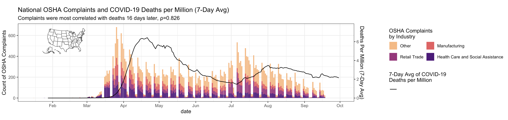
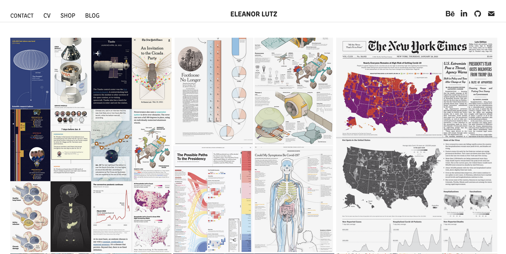
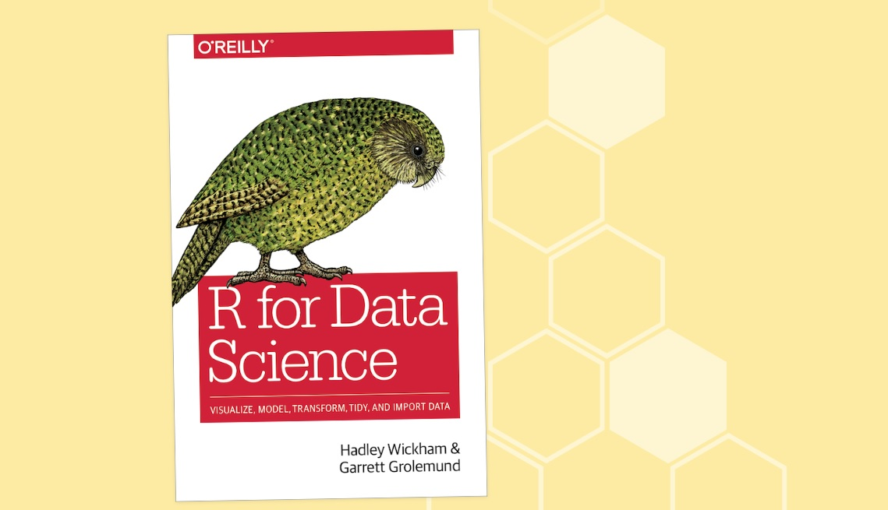
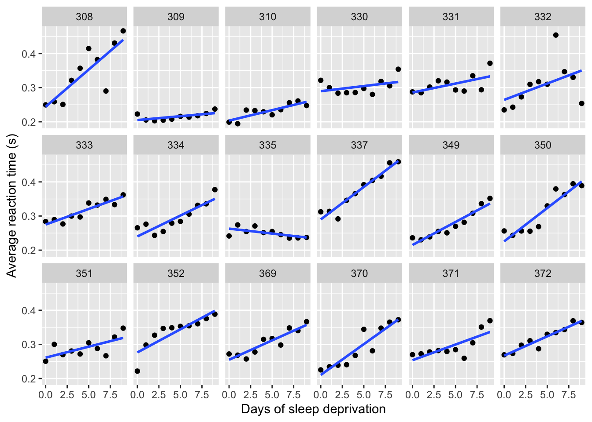
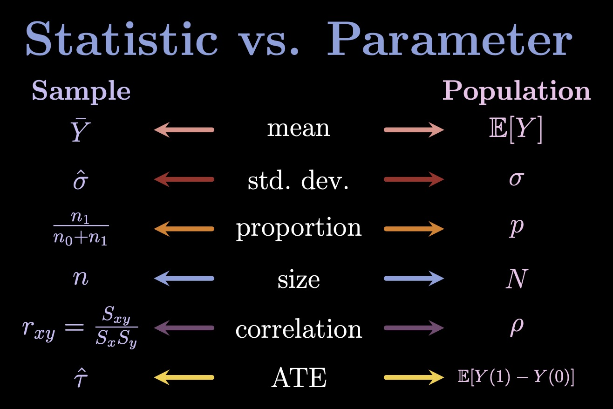
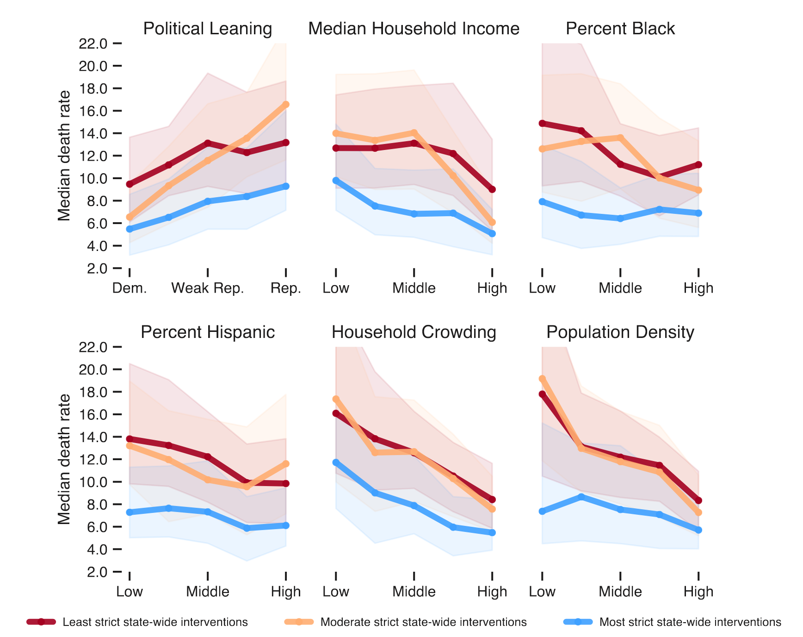
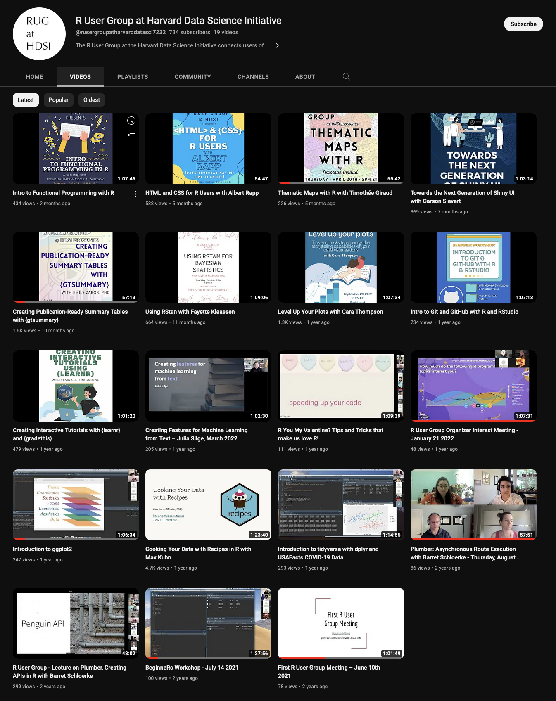
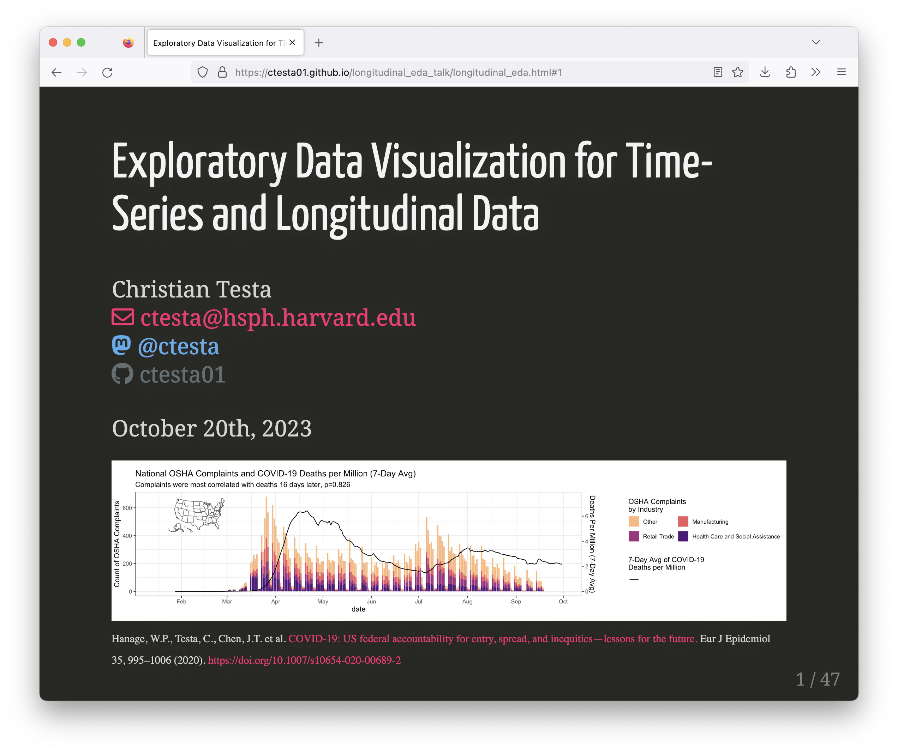

name: xaringan-title
class: left, middle, inverse
background-color: '#BBB'
background-size: cover

```{css, echo = FALSE}
.remark-code-line-highlighted { background-color: rgba(97, 172, 240, .5) !important; }

.huge .remark-code { /*Change made here*/
  font-size: 125% !important;
}


.tiny .remark-code { /*Change made here*/
  font-size: 50% !important;
}
```


# Exploratory Data Visualization for Time-Series and Longitudinal Data

<div style='font-size: 25px;'>

Christian Testa <br>
<a href='mailto:ctesta@hsph.harvard.edu'>`r icons::icon_style(icons::fontawesome('envelope'), fill='#F92672')` ctesta@hsph.harvard.edu</a> <br>
<a style='color: #55acee;' href='https://fediscience.org/@ctesta'>`r icons::icon_style(icons::fontawesome("mastodon"), fill='#55acee')` @ctesta</a> <br>
<a style='color: #636e72;' href='https://github.com/ctesta01'>`r icons::icon_style(icons::fontawesome("github"), fill='#636e72')` ctesta01</a> <br> <br>

</div>


<span style='font-family: Open Sans; font-size: 12px;'>Hanage, W.P., Testa, C., Chen, J.T. et al. [COVID-19: US federal accountability for entry, spread, and inequities—lessons for the future.](https://link.springer.com/article/10.1007/s10654-020-00689-2) Eur J Epidemiol 35, 995–1006 (2020). https://doi.org/10.1007/s10654-020-00689-2</span>
  
```{r echo=F, warning=F, message=F}
# The following code snippet detaches all packages.
# This is important because if tidyverse is already loaded from a previous 
# session, the loading messages won't show in the knit version of this document.
# 
# https://stackoverflow.com/questions/7505547/detach-all-packages-while-working-in-r#39235076
if ('package:tidyverse' %in% search()) 
  invisible(lapply(paste0('package:', names(sessionInfo()$otherPkgs)), detach, character.only=TRUE, unload=TRUE))
```

```{r echo=F, warning=F, message=F}
# some config options
options(knitr.table.format = "html", cache=TRUE)
# knitr::opts_chunk$set(cache=T)
```

---
# Motivations

<span style='font-size: 25px;'>
> "The greatest value of a picture is when it forces us to notice what we never expected to see." –John Tukey

--

> "Visualization is often used for evil - twisting insignificant data changes
and making them look meaningful. Don't do that crap if you want to be my friend.
Present results clearly and honestly. If something isn't working - those
reviewing results need to know." —John Tukey
</span>

--



---
# Aims

- Learn how to use data manipulation tools such as `dplyr` and `tidyr`
- Learn how to use `ggplot2`, a powerful, flexible framework for visualizing data in R
- Learn where to find more resources
  


---
# Before we get started

There are some packages you'll want to make sure you have installed.

```{r eval=F}
install.packages("tidyverse")
```


```{r, message=T, warning=T}
library(tidyverse, quietly = F, warn.conflicts = T)
```

---
# Example Data Set

```{r}
df <- readr::read_csv("example_data/example_dataset_1.csv")
```

--

Why use `readr::read_csv`?
- Reports on the assumed column types, with options to override
- Loads faster
- Loads into a tibble, which are faster, better data.frames.
  
---
# Check out the data

```{r}
knitr::kable(head(df,4))
```

Note that: 
- Data is in a wide format
- Column names need cleaning
- We have groups of participants

---
# Examine the categorical variables

Let's check what those groups are:

```{r}
unique(df$strata)
```

--
```{r}
table(df$gender) 
```

---
# Summarize quantitative variables
--
```{r}
df |> select(-c(strata, gender)) |>
  summary()
```
--
... Let's break this one down.

---

<br>

# Intro to `|>` and dplyr

```{r eval=F}
df |> select(-c(strata, gender)) |>
  summary()
```

--

`|>`, the pipe operator, is built into R since version 4.1.0 (released May 2021).

--
`x |> f()` is equivalent to `f(x)` <br>
`x |> f(y)` is equivalent to `f(x,y)` 


--
`df |> select(-c(strata, gender))` is equivalent to <br>`select(df, -c(strata, gender))`


--
Read `x |> f(y)` as "`x` gets passed to `f` with additional 
argument `y`."


--
Using pipes helps to:
  1. chain several commands together,
  2. without creating unnecessarily nested one-liners, e.g. <br>
  `summary(select(df, -strata))`

---
# What's the deal with select?

```{r eval=F}
df |> select(-c(strata, gender)) |>
  summary()
```

`select` is the command for subsetting the columns of a data.frame or 
tibble.


--
Notice that `strata` and `gender` are not in quotes. This is because `dplyr` and
many of the functions in the tidyverse use tidy-evaluation, which allows users
to reference column names of data.frames and tibbles as if they are variables
within tidyverse functions.


--
The minus sign is saying that we want to remove strata and gender, or
equivalently to select all of the columns except for strata and gender.


```{r echo=F}
df |> select(-c(strata, gender)) |>
  summary()
```

---
# Let's add participant ID numbers

```{r}
df <- df |>
  mutate(id = row_number()) |>
  select(id, everything())

knitr::kable(head(df,3))
```

--

`everything()` is part of the `tidyselect` package and system which 
helps with the programmatic selection of columns and offers other 
helpful functions like `starts_with` or `contains`.

---
# Referring to the left-hand-side

Some functions were written before the `tidyverse` became ubiquitous, 
and don't follow the convention that `data` should be the first argument. 

One example is the `lm` function. 

In situations like that, you can still pipe data into those functions, but
you need to use `_` to refer to the left-hand-side like this:

```{r}
df |> filter(strata == 'A') |> 
  lm(formula = X2005 ~ gender, data = _) |> 
  coef()
```


---
# A note about `|>` vs `%>%`

<small>
`|>` is a pipe now built into base R starting from version 4.1.0. 

Basically the main differences is that `%>%` uses 
the `.` notation to refer to the left-hand-side of the pipe, 
while `|>` uses `_` instead. There are some subtle differences
in what you can do with the left-hand-side (like `%>%` allows you to use `.`
inside nested function calls
while `|>` does not).

In many regards, the two pipes are similar, and you will start to 
see more and more code using `|>` because it is new and faster than `%>%`. 

Also, debugging is a bit easier with `|>`.
</small>

.pull-left[
<a href="https://www.tidyverse.org/blog/2023/04/base-vs-magrittr-pipe/"> </a>
]

.pull-right[
Read more here: <https://www.tidyverse.org/blog/2023/04/base-vs-magrittr-pipe/>
]


---

# Let's convert to a tidy format

```{r}
df <- df |> tidyr::pivot_longer(
  cols = starts_with('X'),
  names_to = 'year',
  values_to = 'rate')

knitr::kable(head(df, 4))
```

---
# Get rid of "X"

```{r}
df <- df |>
  mutate(year = stringr::str_remove(year, "X"))

knitr::kable(head(df, 4))
```

---
# Now we can do some plotting 

.pull-left[
```{r ggplot-point, fig.show='hide'}
ggplot(data = df,  
 aes(x = year, y = rate)) + 
   geom_point()
```

]

.pull-right[
```{r ref.label = 'ggplot-point', echo = FALSE, fig.width=3, fig.height=3, out.width='100%', fig.retina = 6}
```
]

---
# Now let's try geom_line

.pull-left[
```{r ggplot-line, fig.show='hide'}
ggplot(data = df,  
 aes(x = year, y = rate,
     group = id)) + #<<
   geom_line()
```

]

.pull-right[
```{r ref.label = 'ggplot-line', echo = FALSE, fig.width=3, fig.height=3, out.width='100%', fig.retina = 6}
```
]

---
# Adding color

.pull-left[
```{r ggplot-line+color, fig.show='hide'}
ggplot(data = df,  
 aes(x = year, y = rate,
     group = id,
     color = strata)) + #<<
   geom_line(alpha=0.5) #<<
```

]

.pull-right[
```{r ref.label = 'ggplot-line+color', echo = FALSE, fig.width=3, fig.height=3, out.width='100%', fig.retina = 6}
```
]

---
# Facet Wrapping

.tiny[
```{r ggplot-line+color+facetwrap, fig.show='hide'}
ggplot(data = df,  aes(x = year, y = rate, group = id, color = strata)) +
  geom_line(alpha=0.5) + 
  facet_wrap(~strata) #<<
```
]

```{r ref.label = 'ggplot-line+color+facetwrap', echo = FALSE, fig.width=8, fig.height=5, out.height='100%', fig.retina = 6, fig.align='center'}
```

---
# Facet Grid

.tiny[
```{r ggplot-line+color+facetgrid, fig.show='hide'}
ggplot(data = df,  aes(x = year, y = rate, group = id, color = strata)) +
  geom_line(alpha=0.5) + 
  facet_grid(gender~strata) + #<<
  ggtitle("Different strata had different trajectories")
```
]

```{r ref.label = 'ggplot-line+color+facetgrid', echo = FALSE, fig.width=8, fig.height=5, out.height='100%', fig.retina = 6, fig.align='center'}
```


---
# Using Stat Summaries

.tiny[
```{r ggplot-line+statsum+facetwrap, fig.show='hide'}
ggplot(data = df,  aes(x = year, y = rate, group = id, color = gender)) +
  geom_line(alpha=0.5) + 
  facet_wrap(~strata) + 
  stat_summary(aes(group = interaction(strata, gender)), fun = mean, geom='line', color = 'black') + 
  stat_summary(aes(group = interaction(strata, gender), shape=gender), fun = mean, geom='point', size=2, color = 'black') + 
  labs(shape = 'Gender and Strata\nLevel Average', color = 'Gender') +
  ggtitle("Men have higher rates than women")
```
]

```{r ref.label = 'ggplot-line+statsum+facetwrap', echo = FALSE, fig.width=8, fig.height=5, out.height='100%', fig.retina = 6, fig.align='center'}
```

---
# Another way using boxplots

.tiny[
```{r ggplot-boxplot+statsum, fig.show='hide'}
ggplot(data = df,  aes(x = year, y = rate, color = gender)) +
  geom_boxplot(alpha=0.5) + 
  stat_summary(aes(group = interaction(strata, gender), shape=''), position = position_dodge(width=0.75), 
               fun = mean, geom='point', color = 'grey10', alpha=0.8) +
  facet_wrap(~strata) + 
  labs(color = "Gender", shape = "Gender + Strata\nLevel Average") + 
  ggtitle("Boxplots allow us to see the interquartile range clearly")
```
]


```{r ref.label = 'ggplot-boxplot+statsum', echo = FALSE, fig.width=8, fig.height=5, out.height='100%', fig.retina = 6, fig.align='center'}
```

---
# Using `geom_ribbon`

.tiny[
```{r ggplot-geomribbon, fig.show='hide'}
df |> group_by(strata, gender, year) |>
  summarize(
    percentile_97.5 = quantile(rate, 0.975),
    percentile_2.5 = quantile(rate, 0.025),
    mean = mean(rate),
    .groups = 'keep') |>
  
  ggplot(aes(x = year, y = mean, ymax = percentile_97.5, 
       ymin = percentile_2.5, group = gender, fill = gender, color = gender)) +
    geom_ribbon(alpha=0.5, linewidth = 0) +
    geom_line(aes(linetype='')) +
    facet_wrap(~strata) + 
    scale_color_manual(values = c('M' = '#2980b9', 'F' = '#c0392b')) + 
    labs(linetype = 'Gender+Strata\nLevel Average', fill = 'Gender', color = 'Gender', y = 'Rate') + 
    ggtitle(paste0("The difference between men and women was consistent over time"))
```
]

```{r ref.label = 'ggplot-geomribbon', echo = FALSE, fig.height=4, fig.width=6, out.height='100%', fig.retina = 6, fig.align='center'}
```

---
# Using plotly for interactive graphics

.tiny[
```{r ggplotly, fig.show='hide', echo=TRUE, message=FALSE, warning=FALSE}
suppressMessages(library(plotly))
ggplotly() |> layout(width = 8, height = 3.5)
```
]

```{r ref.label = 'ggplotly', out.width = '100%', echo = FALSE, fig.retina = 6, fig.align='center'}
```


---
# Widening Data for Correlation Analysis

Before we can look at correlation across the years, we need 
to widen the dataframe (similar to how it was originally formatted).

```{r warning=F}
df_wide <- df |>
  tidyr::pivot_wider(id_cols = c(id, strata, gender),
                     names_from = year,
                     values_from = rate)
knitr::kable(head(df_wide, 3))
```

---
# Correlation Plot

.tiny[
```{r ggally-corplot, warning=F, message=F, fig.show='hide'}
# install.packages(GGally)
library(GGally)
ggpairs(df_wide, aes(color = strata, alpha=0.25), columns = c('2005', '2010', '2015', '2020'), progress=F)
```
]

```{r ref.label = 'ggally-corplot', echo = FALSE, fig.height=6, fig.width=8, out.height='100%', fig.retina = 6, fig.align='center'}
```

---
# Bivariate Pairs Plots

```{r ggally-bivariate, warning=F, message=F, fig.show='hide'}
ggbivariate(df, outcome = 'gender', explanatory = 'strata') + 
  theme(legend.position = 'bottom') + 
  ggtitle("Strata were about evenly split across gender")
```

```{r ref.label = 'ggally-bivariate', echo = FALSE, fig.height=5, fig.width=6, out.height='100%', fig.retina = 6, fig.align='center'}
```

---


# Where you can learn more 

  
For data manipulation and visualization:


  
- R for Data Science, by Garrett Grolemund and Hadley Wickham, [r4ds.had.co.nz](https://r4ds.had.co.nz)
- The ggplot2 Website, [ggplot2.tidyverse.org](https://ggplot2.tidyverse.org)
- The [RStudio Cheatsheets](https://rstudio.com/resources/cheatsheets/) (I suggest starting with [dplyr](https://github.com/rstudio/cheatsheets/raw/master/data-transformation.pdf) and [ggplot2](https://github.com/rstudio/cheatsheets/raw/master/data-visualization-2.1.pdf))
- Watch the [TidyTuesday tutorials on YouTube](https://www.youtube.com/results?search_query=tidytuesday) or check out [TidyTuesday 
  on GitHub](https://github.com/rfordatascience/tidytuesday/)
  
  
  
--
For longitudinal data analysis: 
- [Applied Longitudinal Analysis by Garrett Fitzmaurice, Nan Laird, and James Ware](https://content.sph.harvard.edu/fitzmaur/ala2e/)
- [Marie Davidian's Slides on Modeling and Analysis of Longitudinal Data](https://www4.stat.ncsu.edu/~davidian/enar06_handout.pdf)
- [Patrick Hagearty's notes on Longitudinal Data Analysis](https://faculty.washington.edu/heagerty/Courses/VA-longitudinal/private/LDAchapter.pdf) (fairly technical)
- Longitudinal Data Analysis: Autoregressive Linear Mixed Effects Models, by Ikuko FunatogawaTakashi Funatogawa (very technical)

---
# How to take your longitudinal analysis further

.pull-left[
<!-- <div style='font-size: 75% !important;'> -->
<ul>
Use models to make inferences about your data. Models for longitudinal data
often include the following features: <br> <br>
<li> Multi-level or random effects design</li>
<li> Generalized Linear Models</li>
<li> Auto-regressive</li>
<li> Treatment of missing data</li>
</ul>
<!-- </div> -->
]

.pull-right[


<span style='font-size: 16px;'>
`library(lme4)` <br>
`lmer(Reaction ~ Days + (Days|Subject), sleepstudy)`
</span>
]

---

<br>

# How to take your longitudinal analysis further (part 2)

Define your scientific question ($\to$ statistical parameter) of interest first! 

Are you interested in a marginal mean? 
$$\mathbb E[Y \mid T = t]$$

Are you interested in subject-specific rates of increase?
$$ \frac{d}{dt} \mathbb E[ Y \mid T = t, \; \mathtt{id} = i] $$

* Is your hypothesis that heterogeneity in individual slopes exists? 
  * Or that you could predict them from certain baseline covariates? 
* Is your hypothesis about a covariate predicting worsening/improving
trends? 

---
# Get More Inspiration 

.pull-left[
* [Georgios Karamanis](https://karaman.is/)
* [Cedric Scherer](https://cedricscherer.com)
* [Eleanor Lutz](https://eleanorlutz.com/)
* [Flowing Data](https://flowingdata.com/)

<span style='font-size: 12px;'>Kaashoek J, Testa C, Chen JT, Stolerman LM, Krieger N, Hanage WP, et al. [The evolving roles of US political partisanship and social vulnerability in the COVID-19 pandemic from February 2020–February 2021.](https://journals.plos.org/globalpublichealth/article?id=10.1371/journal.pgph.0000557) PLOS Global Public Health. 2022 
</span>
]

.pull-right[

]

---
# Join the R User Group! &nbsp; rug-at-hdsi.org

.pull-left[
<br>
Join at <https://rug-at-hdsi.org> and check out our [YouTube](https://www.youtube.com/@rusergroupatharvarddatasci7232/videos)
]
<!-- .pull-right[

] -->


---
# Find this talk on my github




<https://github.com/ctesta01/longitudinal_eda_talk>

---
# Image Credits

<div style='font-size:small'>

<ul>
<li>R for Data Science: https://www.dataoptimal.com/wp-content/uploads/R-for-Data-Science.jpg </li>
<li>Magrittr Logo: https://magrittr.tidyverse.org/logo.png</li>
<li>Tidy Tuesday Logo: https://github.com/rfordatascience/tidytuesday/</li>
<li>Escalating Drought: https://www.scientificamerican.com/article/climate-change-drives-escalating-drought/</li>
</ul>
  
</div>
